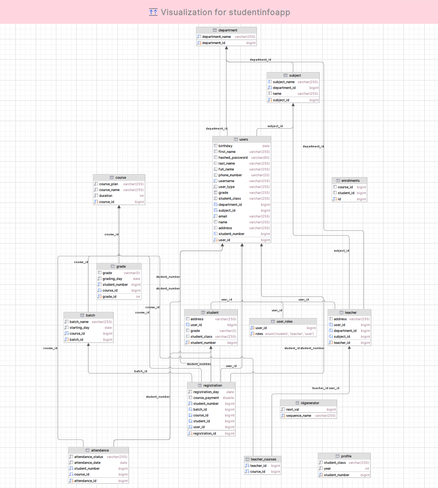
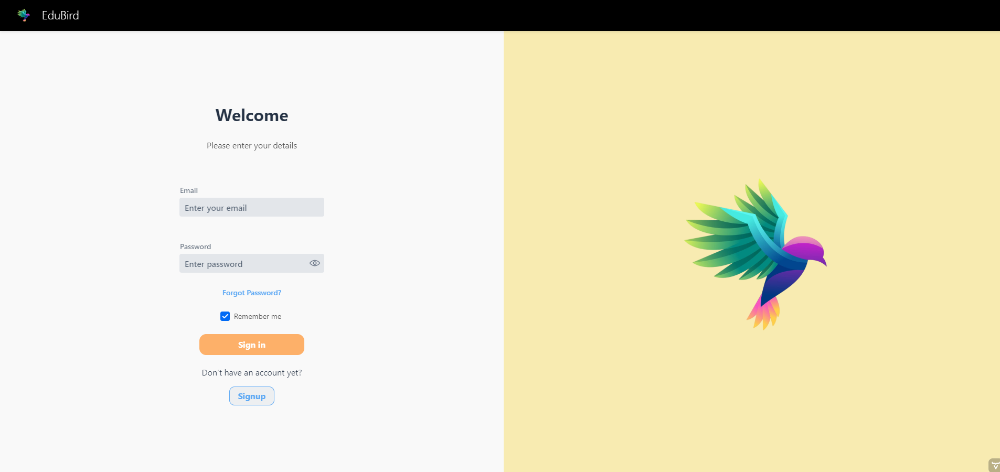
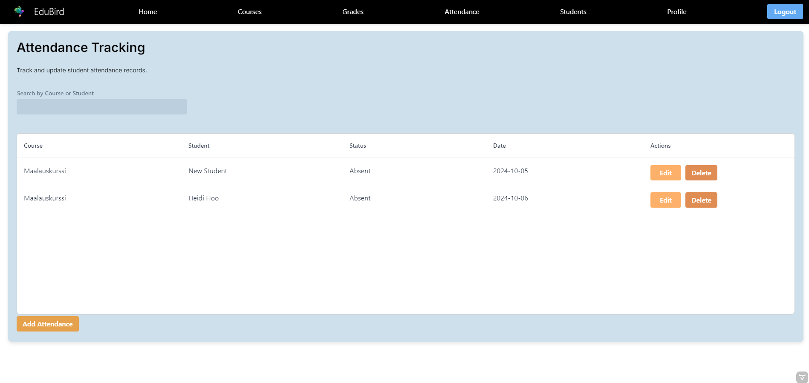

# Student Information System

## Project Overview
The Student Information System is a web application designed to facilitate student and teacher interactions, manage course enrollments, track attendance, and handle grade management. It provides a comprehensive platform for educational institutions to manage their academic activities efficiently.

## Getting Started

### Prerequisites
- Java Development Kit (JDK) 21
- Maven
- MySQL
- Docker (Optional for containerized deployment)

### Installation
1. Clone the repository:
    ```bash
    git clone https://github.com/gitober/Student-Information-System.git
    ```
2. Navigate to the project directory:
    ```bash
    cd Student-Information-System/student-information-app
    ```
3. Configure the `.env` file to src/main/resources folder.
4. Build the project using Maven:
    ```bash
    mvn clean package
    ```

### Running the Application
- Using Maven:
    ```bash
    mvn spring-boot:run
    ```
- Using Docker:
    ```bash
    docker build -t student-information-app .
    docker run -p 8080:8080 student-information-app
    ```

## Configuration Files

### .env File (Sensitive information hidden)
```plaintext
# Database settings
DB_USERNAME=your_db_username
DB_PASSWORD=your_db_password
DB_URL=jdbc:mysql://localhost:3306/studentinfoapp

# Email settings
EMAIL_USERNAME=your_email
EMAIL_PASSWORD=your_email_password
SMTP_HOST=smtp.gmail.com
SMTP_PORT=587
```

### `application.properties` Highlights
```properties
# Server port
server.port=${PORT:8080}

# Database and JPA settings
spring.datasource.url=${DB_URL}
spring.datasource.username=${DB_USERNAME}
spring.datasource.password=${DB_PASSWORD}

# Email settings
spring.mail.host=smtp.gmail.com
spring.mail.port=587
spring.mail.username=${EMAIL_USERNAME}
spring.mail.password=${EMAIL_PASSWORD}
```

### Dockerfile
- The project uses a multi-stage Dockerfile to build and run the application efficiently. See the Dockerfile for the detailed setup.

### Jenkins Pipeline
- The Jenkins pipeline automates code checkout, build, testing, and code coverage report generation. See the pipeline script in the root directory for more details.

## Database Schema
The Database Schema image illustrates the structure of the database used in this application. It includes tables for Users, Courses, Grades, Attendance, and more, along with their relationships. Primary and foreign keys are used to maintain data integrity and enable efficient data retrieval.



## ER Diagram
The ER Diagram provides a visual representation of the relationships between various entities in the system, such as Users, Students, Teachers, Courses, Departments, etc. It showcases how data is interconnected, helping to understand the database's logical structure.


## Application Walkthrough

### Login, Forgot Password, and Registration
- **Login:** This is the main page where users can log in using their credentials. Enter your email and password, and click "Sign in" to access your dashboard.
  

- **Forgot Password:** If you forget your password, click the "Forgot Password?" link on the login page. Enter your registered email to receive a password reset link.
  

- **Register:** New users can create an account by filling out their details, such as name, email, phone number, and role (student or teacher). Click "Register" to complete the registration process.
  

### Student Features
- **Dashboard:** This is the student's main interface, providing access to various functionalities such as viewing courses, checking grades, and editing profiles.
  

- **Courses:** View enrolled courses and available courses. Use the "Enroll" button to register for a course or "View Attendance" to check attendance records.
  

- **Edit Profile:** Update personal details such as name, email, and phone number. Click "Save" to apply the changes.
  

- **Grades Overview:** View grades for all completed courses. This page displays the course name, grade, and the date the grade was assigned.
  

### Teacher Features
- **Dashboard:** The teacher's main interface for managing students, courses, attendance, and grading. It provides quick access to all essential functions.
  

- **Attendance Tracking:** Allows teachers to manage student attendance records. Search by course or student to update attendance status.
  

- **Course Management:** Teachers can add, edit, and delete courses. Use the "Add Course" button to create new courses or "Edit" to modify existing ones.
  

- **Edit Profile:** Update teacher details such as name, email, department, and subject. Click "Save" to save changes.
  

- **Grades Management:** Manage student grades for specific courses. Use the "Edit" button to update a student's grade or "Add Grade" to enter a new one.
  

- **Student Management:** View and update student profiles. Use the search feature to find students by first or last name.
  


## Technologies Used
- Java 21
- Spring Boot 3.2.8
- Vaadin 24.4.10
- MySQL for production, H2 for testing
- Maven for dependency management
- Docker for containerization
- Jenkins for CI/CD
- JUnit and Mockito for testing
- Lombok for reducing boilerplate code
- SLF4J and Logback for logging

## Further Development Plan
- Introduce admin role for central management.
- Implement real-time communication features like chat between students and teachers.
- Add comprehensive analytics and reporting tools.
- Integrate calendar and notification systems.
- Enable multi-language support for broader accessibility.

## Contributing
1. Fork the repository.
2. Create a new branch: `git checkout -b feature-branch-name`
3. Make your changes and commit them: `git commit -m 'Add some feature'`
4. Push to the branch: `git push origin feature-branch-name`
5. Submit a pull request.

## Testing
- Please refer to the [testing README](./student-information-app/src/test/README.md) for details on running unit and integration tests using JUnit and Mockito.

## References
- [Vaadin Documentation](https://vaadin.com/docs)
- [Spring Boot Reference](https://spring.io/projects/spring-boot)
- [MySQL Documentation](https://dev.mysql.com/doc/)
